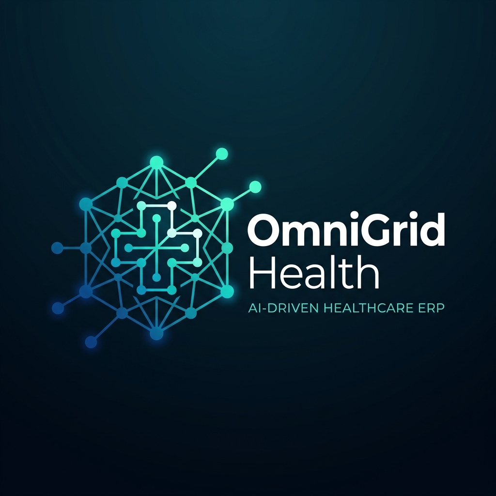

<div align="center">
  
  <h1>OmniGrid Health ERP</h1>
  <p><strong>A Next-Generation, AI-Powered Hospital Information System (HIS)</strong></p>
</div>

---

## 🏥 Overview

**OmniGrid Health** is a massive, enterprise-grade Hospital Information System designed to manage every aspect of a modern medical facility. Developed across 5 distinct phases and 14 comprehensive sprints, the platform handles everything from Outpatient Registration and E-Prescriptions to Blood Bank Inventory, Hospital-Acquired Infection Surveillance, and AI-Powered Predictive Analytics.

The system is split into three core repositories within this monorepo:
*   **Backend:** Spring Boot 3 + Java 21 RESTful API
*   **Frontend:** Next.js 14 + React + TailwindCSS Web Client
*   **Mobile:** Android Jetpack Compose scaffolding (Physician App)

## 🏗️ Architecture Stack

*   **Core Backend:** Java 21, Spring Boot 3.3, Spring Data JPA, Spring Security
*   **Core Frontend:** Next.js 14 (App Router), React, Tailwind CSS, Zustand, Axios
*   **Database:** PostgreSQL 16
*   **Migrations:** Flyway (V1 through V18 sequential schema management)
*   **Caching & Sessions:** Redis
*   **Search Engine:** Elasticsearch (for ICD-10 and Drug cataloging)
*   **Infrastructure:** Docker & Docker Compose

## 🚀 Features (The 5 Phases)

### Phase 1: Foundation & Core Clinical
*   Role-Based Access Control (RBAC) & Authentication.
*   Patient Registration & Demographics.
*   Doctor & OPD (Outpatient Department) Management (Queues, Schedules).
*   Clinical Suite: E-Prescriptions, ICD-10 Diagnoses, SOAP Notes.

### Phase 2: Full Clinical Expansion
*   **LIS (Lab Information System):** Order tracking, processing, and reporting.
*   **Radiology:** Study scheduling and PACS integrations.
*   **Pharmacy:** Drug dispensing, interactions, and inventory.
*   **Nursing & ICU:** Hourly flowsheets, MAR (Medication Administration Record), Vitals (GCS, NEWS).
*   **OT & Discharge:** Surgical schedules, WHO safety checklists, discharge summaries.
*   **Billing:** Comprehensive IPD Master Bills and invoicing.

### Phase 3: Hospital Operations
*   **Supply Chain:** Purchase Orders, Vendor management, Inventory dispatch.
*   **Facilities:** Housekeeping, Transport, Work Orders.
*   **Staff Management:** Leave requests, Duty Rosters, Cross-consultations.
*   **Auxiliary Clinical:** Blood Bank tracking, Hospital Acquired Infection (HAI) surveillance.

### Phase 4: AI & Mobile Platform
*   **Voice Scribe:** NLP pipeline simulating Whisper models to convert raw speech into structured SOAP notes and extract entities (Symptoms, Meds, Vitals).
*   **Mobile App:** Jetpack Compose scaffolding for physician rounds.

### Phase 5: Advanced Analytics
*   **Command Center:** High-level executive dashboards.
*   **Predictive AI:** Sepsis and Readmission risk alerts.
*   **Quality Metrics:** NABH KPIs and revenue tracking.

---

## 🛠️ Local Development Setup

### Prerequisites
*   [Docker Desktop](https://www.docker.com/products/docker-desktop/)
*   [Java 21 (Temurin)](https://adoptium.net/)
*   [Maven 3.9+](https://maven.apache.org/)
*   [Node.js 20+](https://nodejs.org/)

### 1. Start Infrastructure
Start PostgreSQL, Redis, and Elasticsearch using Docker Compose:
```bash
cd codebase
docker-compose up -d
```
*Note: You may need to wait 30 seconds for Elasticsearch to fully boot.*

### 2. Start the Backend
The backend utilizes Flyway. Upon booting, it will automatically execute SQL scripts V1 through V18, generating the complete relational database structure. A `DatabaseSeeder.java` will also inject mock data (Staff, Blood Inventory, etc.) so the UI is not empty.

```bash
cd codebase/backend
mvn spring-boot:run
```
*The API will be available at `http://localhost:8080/api/v1/`*

### 3. Start the Frontend
```bash
cd codebase/frontend
npm install
npm run dev
```
*The web client will be available at `http://localhost:3000`*

---

## ☁️ Production Deployment

### Database (Supabase)
To host the database on Supabase:
1. Create a Supabase project.
2. In your Backend hosting environment (e.g., Render, Railway, AWS), set the following environment variables:
   *   `SPRING_DATASOURCE_URL`: `jdbc:postgresql://aws-0-[REGION].pooler.supabase.com:5432/postgres` (Using port 5432 to bypass PgBouncer during Flyway migrations is recommended).
   *   `SPRING_DATASOURCE_USERNAME`: `postgres.[YOUR_PROJECT_ID]`
   *   `SPRING_DATASOURCE_PASSWORD`: `[YOUR_PASSWORD]`
3. Flyway will automatically configure the Supabase database on startup.

### Frontend (Vercel)
The Next.js frontend is strictly typed and optimized.
1. Connect your GitHub repository to Vercel.
2. Ensure the Framework Preset is set to **Next.js**.
3. Vercel will automatically run `npm run build` and deploy the application globally.

---
*OmniGrid Health — Engineered for the Future of Care.*
